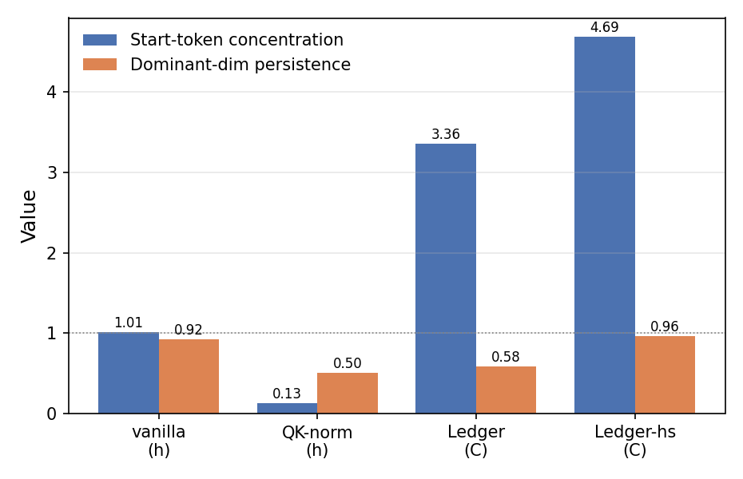
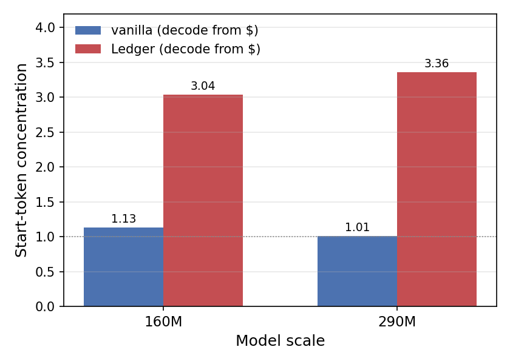

# Ledger Residuals

A controlled test of whether **massive activations** in transformers are a removable *artifact*
or a *functional* necessity.

Massive activations are a handful of hidden dimensions whose magnitude is far above the median,
concentrated on the sequence-start token. They are widely debated: one camp says they are a
side effect of the architecture that can be designed away, the other says the model needs them.

We test this directly. We give the model a clean, protected channel to keep its answer in, the
thing the artifact view says should make massive activations unnecessary, and check whether they
go away.

**They do not.** The model rebuilds the same start-token outlier inside the protected channel,
at both 160M and 290M parameters, at matched loss. Pressuring the channel to be sparse makes the
outlier *stronger*, not weaker. Massive activations re-emerge in whichever representation the
model decodes from, which is evidence for the functional side of the debate.

## The architecture

Ledger Residuals split the single residual stream into two streams with different roles:

```
  ┌──────────────────────────────────────────────────────────┐
  │  D — Deliberation stream  (mutable scratchpad)            │
  │      • every sublayer may WRITE and ERASE it (delta rule) │
  │      • where the model "thinks"                           │
  └───────────────┬──────────────────────────────────────────┘
                  │  commit gate  (one-directional D -> C, opens in later layers)
                  ▼
  ┌──────────────────────────────────────────────────────────┐
  │  C — Commitment stream  (protected ledger)                │
  │      • APPEND-ONLY, never overwritten                     │
  │      • the ONLY stream the unembedding decodes            │
  │      • where the model "records the answer"               │
  └──────────────────────────────────────────────────────────┘
```

Each sublayer reads `RMSNorm(D + λ·C)`, updates `D` by erasing then writing, and may promote the
result into `C` through the commit gate. The coupling is one-directional: `C` nudges `D` only
weakly and is never overwritten by it. The model decodes only from `C`.

This is built as a measurement instrument, not a competing model. At one setting of its gates
(no erase, full write, no commitment) it reduces **exactly** to a standard pre-norm transformer
(verified to a logit difference below `1e-3` in `tests/test_degeneracy.py`), so any difference we
measure comes from the residual factorization alone and not from added capacity.

## The result

Decoded-channel outlier signature at 290M, at matched loss. The Commitment channel `C` (Ledger,
Ledger-hs) keeps a persistent, start-token-concentrated outlier; QK-norm removes it; the
heavy-sparsity variant makes it stronger.



The same pattern holds across scale: the channel the model decodes from stays strongly
start-token-concentrated under Ledger (decodes from `C`) and near-neutral under a standard
transformer (decodes from `h`).



The relocation has no measurable cost or benefit: all configurations reach the same perplexity,
and weight quantization is identical across them. Reducing the decoded outlier's magnitude is
achieved more simply by QK-normalization.

## Configurations

All configs share one model/data/training path and differ only in the residual operator.

| Config      | Residual operator              | Decodes from |
|-------------|--------------------------------|--------------|
| `vanilla`   | standard pre-norm              | `h`          |
| `suppress`  | pre-norm + QK-norm             | `h`          |
| `ledger`    | scratch / commitment           | `C`          |
| `ledger-hs` | ledger, 6× commit-sparsity     | `C`          |

## Usage

```bash
pip install -e .

# unit tests, including the exact-reduction-to-vanilla guard
pytest

# local CPU smoke test (tiny model, few steps — checks correctness/shapes)
python -m ledger.train --config configs/toy_smoke.yaml --device cpu --max-steps 20
```

Full language-model runs use [Modal](https://modal.com) (no local GPU required). The headline
sweep trains `vanilla`, `suppress`, `ledger`, and `ledger-hs` in parallel and measures the
per-sublayer activation profile of each decoded channel:

```bash
modal run --detach modal_lm.py::sweep --config configs/lm_scale.yaml
```

## Repo layout

```
src/ledger/
  residual_ops.py   residual operators behind one code path (vanilla, hc2, delta_only, ledger)
  model.py          flat-sublayer GPT + per-sublayer activation stats
  layers.py         RMSNorm, attention (+QK-norm), MLP
  probe.py          outlier probes: kurtosis, fixed-dim ratio, persistence, BOS
  train.py          device-agnostic toy training loop
  train_lm.py       language-model training + activation measurement
  data/             synthetic (commit-vs-revise) and text (FineWeb-Edu) loaders
configs/            matched configs for each scale and operator
tests/              shape tests + the degeneracy guarantee
modal_lm.py         Modal GPU entrypoint (thin wrapper over train_lm)
```

## Metrics

The probes separate two things that are easy to conflate:

- **magnitude** — excess kurtosis of the activations.
- **structure** — the fixed-dimension ratio (largest mean-abs dimension over the median),
  the persistence of the dominant dimension across layers, and its start-token concentration.

The central finding is that an architecture can lower the *magnitude* of the decoded outlier
while its *structure* comes back unchanged.
